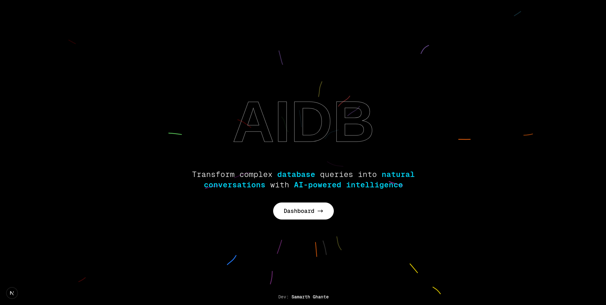

# AIDB: Chat w/ your database as if it is a Human!

[](https://drive.google.com/file/d/19e-If6fHqiMqN-SyrCZydS1Y2w1az4YD/view?usp=sharing)

<p align="center">  
🚀 Interact with your databases effortlessly using natural language. Upload your SQL files and let AI handle the complex queries through intelligent, conversational insights. No more SQL headaches! 🧠💡  
</p>


## Features

- 🚀 Get Insights from the database without writing a single line of code  
- 🧠 Intelligent Relation and Schema Extraction
- 🤖 Advanced flowchain that provides real-time actual context to the LLMs
- ⚙️ Comprehensive support for MySQL dumps, SQLite files  
- 🔍 Longer context memory 


## More Screenshots  
  
  
  
  
  


## Setup Guide

**Prerequisites:** Node.js 18+, npm/yarn, Groq API key  

**Installation & Run:**

```
git clone <repository-url>
cd aidb
npm install    # or yarn install
# Setup .env file with API keys
npm run dev    # or yarn dev
```

Open [http://localhost:3000](http://localhost:3000) in your browser to use AIDB.


## License & Credits

This project is open source under the [MIT License](LICENSE).  
